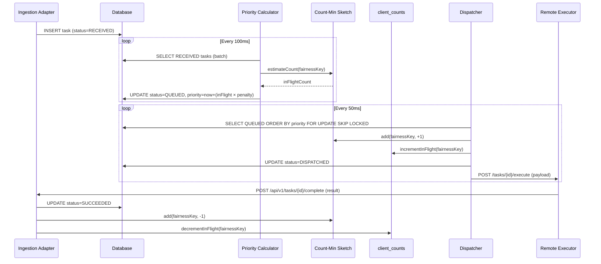

# Design Document: Equalix - Eventually Fair Weighted Queue

**Version 1.1** (successor to 1.0; supersedes it).

This document describes the full design of Equalix: the Count-Min Sketch (CMS) fairness
mechanism, in-flight slot management, adaptive RPS throttling, sequential execution mode, and the
Watchdog reconciliation loop. The 1.1 revision tightens the narrative introduction, moves the
CMS-vs-SQL performance comparison earlier in the CMS section, standardizes on **fairness key** as
the canonical term, expands the error-handling procedures, and aligns configuration and monitoring
sections with the code as it exists in this repository.

---

## 1. Introduction

### 1.1 The problem: fair scheduling under multi-tenant load

Imagine a SaaS platform where multiple tenants submit asynchronous processing jobs - image
transcoding, report generation, data exports. Each tenant is assigned a **fairness key** (e.g. a
tenant ID, customer ID, or project ID) that identifies the logical group for which fairness is
enforced.

**The naïve FIFO approach** puts every job in a single queue sorted by arrival time. This works
until tenant A submits 10,000 jobs while tenant B submits 1. Tenant B waits behind all of tenant
A's work - even though tenant A is already monopolizing the system. Arrival order alone is not a
fairness policy.

**The SQL `COUNT(*)` approach** attempts to fix this by counting how many tasks each fairness key
currently has in flight and deprioritizing keys with many active tasks. This is correct, but the
cost is steep. Every scheduling decision runs
`SELECT COUNT(*) ... GROUP BY fairness_key` against potentially millions of rows. At 10,000
ingested tasks per second across hundreds of tenants, this aggregate query dominates database load
and caps effective throughput.

**Equalix's solution** replaces the count query with a
[Count-Min Sketch](https://en.wikipedia.org/wiki/Count%E2%80%93min_sketch) (CMS) - a probabilistic
in-memory structure that answers "how many tasks does this fairness key have in flight?" in O(1)
time using fixed memory (~128 KB for 10,000 fairness keys). Combined with a **virtual-time
priority algorithm** that automatically penalizes fairness keys with many in-flight tasks and an
**Adaptive RPS controller** that throttles dispatching when the downstream executor is under
stress, Equalix provides fair, high-throughput, resilient scheduling across any number of
tenants.

### 1.2 Terminology

- **Fairness key** - a string that identifies a logical group for which fairness is enforced.
  All scheduling decisions are made at the fairness-key level. The `client_counts` table maps
  fairness keys to in-flight counts; the historical name is retained for schema compatibility.
- **Weight** - a positive decimal assigned to a task (default 1.0). Higher weight receives a larger share of dispatch slots (`priority` divides the in-flight penalty by weight).
- **Virtual time / priority** - a computed timestamp-based value that penalizes fairness keys with
  many in-flight tasks, ensuring they yield scheduling slots to lighter keys.
- **In-flight** - a task that has been dispatched to a worker but not yet completed (statuses
  `DISPATCHED` or `COMMITTED`).
- **Eventually fair** - the fairness guarantee holds over a sliding window rather than at every
  instant. See §10.4.

### 1.3 Goals

- **Fairness**: proportional processing across fairness keys, weighted by task weight.
- **High throughput**: designed for the 10,000+ RPS range without database aggregate queries on
  the hot path.
- **Adaptive**: dynamic throttling based on remote executor latency and error rate.
- **Resilient**: retry, timeout, and reconciliation cover crashes and missed callbacks.
- **Payload-agnostic**: tasks carry opaque binary payloads; the queue interprets only scheduling
  metadata.

---

## 2. System overview

- **Ingestion** - Kafka (or REST) adapters accept messages and persist them as `RECEIVED` with
  the fairness key, weight, and payload.
- **Priority calculation** - a scheduled job reads batches of `RECEIVED` tasks, asks the CMS for
  each fairness key's in-flight count, computes
  `priority = now + (inFlightCount × penaltyFactor / weight)`, and transitions tasks to `QUEUED`.
- **Dispatch** - a scheduled dispatcher selects `QUEUED` tasks ordered by priority, applies an
  optional hard quota per fairness key, and moves selected tasks to `DISPATCHED` while
  incrementing CMS and `client_counts`.
- **Remote execution** - the executor adapter fires the task at the remote system. Completion
  arrives via a webhook.
- **Completion** - the completion handler sets the terminal status, decrements CMS and
  `client_counts`, and feeds the Adaptive RPS controller.
- **Adaptive RPS** - monitors remote executor latency and error rate; adjusts the dispatch RPS
  and the penalty factor used by priority calculation.
- **Watchdog** - every 5 minutes, reconciles `client_counts` against the actual task table and
  rebuilds the CMS from the corrected snapshot.

---

## 3. Component interaction - sequence diagram



---

## 4. Architecture (hexagonal)

- **Domain core**: `Task`, `TaskStatus`, `ClientCounts`, `ClientSequenceState`, use cases, and
  scheduling services. Pure Java - no Spring, JPA, or HTTP imports.
- **Incoming ports**: `TaskIngestionPort`, `TaskCompletionPort`, `TaskManagementPort`.
- **Outgoing ports**: `TaskRepositoryPort`, `ClientCountsRepositoryPort`,
  `ClientSequenceStateRepositoryPort`, `CMSProviderPort`, `RemoteExecutorPort`,
  `PerformanceMonitorPort`.
- **Driving adapters**: REST controllers, Kafka consumer, scheduled jobs (priority calc,
  dispatcher, watchdog, sequential dispatcher, block/passthrough recovery).
- **Driven adapters**: PostgreSQL (Spring Data JPA + Flyway), local CMS (stream-lib) or
  distributed CMS (Redis), HTTP remote executor (WebClient), Micrometer metrics.

---

## 5. Components and responsibilities

### 5.1 Ingestion adapters

REST (`TaskIngestionController`) and Kafka (`TaskIngestionKafkaConsumer`) accept messages,
validate metadata, and delegate to `CreateTaskUseCase`. A new task is persisted as `RECEIVED`
with no priority - priority calculation is deferred to keep ingestion fast. Sequential tasks
also `findOrCreate` a `client_sequence_state` row so the first task of a key can dispatch.

### 5.2 Task repository (PostgreSQL)

Table `tasks`:

| Column                 | Type           | Notes                                                         |
|------------------------|----------------|---------------------------------------------------------------|
| `id`                   | UUID PK        |                                                               |
| `fairness_key`         | VARCHAR(255)   | Identifies the logical group                                  |
| `weight`               | DECIMAL(10,4)  | Default 1.0                                                   |
| `status`               | ENUM           | RECEIVED → QUEUED → DISPATCHED → COMMITTED → SUCCEEDED/FAILED/TIMEOUT |
| `priority`             | BIGINT NULL    | Virtual time; null until QUEUED                               |
| `payload`              | BYTEA          | Opaque binary                                                 |
| `created_at`           | TIMESTAMPTZ    |                                                               |
| `updated_at`           | TIMESTAMPTZ    |                                                               |
| `completed_at`         | TIMESTAMPTZ    | Set on final states                                           |
| `retry_count`          | INT            |                                                               |
| `last_error`           | TEXT           |                                                               |
| `result`               | BYTEA          | Stored on completion for sequential passthrough               |
| Sequential columns     |                | See §14                                                       |
| `version`              | BIGINT         | Optimistic locking                                            |

Indexes: `(status, priority)` for the dispatcher, `(status, created_at)` for anti-starvation and
cleanup.

### 5.3 `client_counts` - durable in-flight counter

| Column            | Type                       |
|-------------------|----------------------------|
| `fairness_key`    | VARCHAR(255) PK            |
| `in_flight_count` | INT NOT NULL DEFAULT 0     |
| `updated_at`      | TIMESTAMPTZ                |

The dispatcher increments this atomically on every dispatch; the completion handler decrements
using `GREATEST(0, in_flight_count - 1)`. It is the durable source of truth for hard quota
enforcement and Watchdog reconciliation.

### 5.4 Count-Min Sketch

Two adapters implement `CMSProviderPort`:

- `CountMinSketchAdapter` - local in-memory sketch (positive and negative deltas). Default.
- `RedisCMSAdapter` - distributed sketch stored in Redis. Selected via
  `app.queue.cms.mode=redis`. Recommended when running 3+ instances with strict cross-instance
  fairness requirements. See §7.7.

On startup, the local adapter warms up from `client_counts`. The Redis adapter needs no warm-up
because Redis retains state across restarts.

### 5.5 Priority calculator

Scheduled every `app.queue.priority-calc-interval` (default 100ms) under `@SchedulerLock`. For a
batch of `RECEIVED` tasks:

```
inFlight      = cms.estimateCount(fairnessKey)
penaltyFactor = adaptiveRpsController.getPenaltyFactor()
priority      = clock.instant().toEpochMilli() + (inFlight × penaltyFactor / weight)
```

Sequential tasks receive an additional sequence-based boost and a large penalty if the fairness
key is currently blocked (see §14). Each task is persisted with `status=QUEUED` and the new
priority in a single `save`.

### 5.6 Dispatcher

Scheduled every `app.queue.dispatcher-interval` (default 50ms) under `@SchedulerLock`.

1. Promote any starved tasks (`age > maxQueuedTimeMs`) by setting their priority to 0.
2. Compute `freeSlots = maxTasksInProcess − globalInFlight`. When adaptive RPS is enabled,
   also cap `freeSlots` by `ceil(currentRps × intervalSeconds)`.
3. Query dispatchable tasks:

    ```sql
    SELECT t.*
    FROM tasks t
    LEFT JOIN client_counts cc ON t.fairness_key = cc.fairness_key
    WHERE t.status = 'QUEUED'
      AND t.is_sequential = false
      AND (:maxPerClient IS NULL
           OR cc.in_flight_count < :maxPerClient
           OR cc.in_flight_count IS NULL)
    ORDER BY t.priority ASC NULLS LAST
    LIMIT :freeSlots
    FOR UPDATE OF t SKIP LOCKED
    ```

4. For each selected task: set `status=DISPATCHED`, increment CMS (+1), increment `client_counts`,
   call `RemoteExecutorPort.send()`.

Sequential tasks are dispatched by a separate `SequentialDispatcherService` (see §14).

### 5.7 Remote executor adapter

`HttpRemoteExecutorAdapter` posts a binary envelope
(`[16 bytes UUID][4 bytes len][payload][4 bytes len][previousResult]`) to
`{base-url}/tasks/{id}/execute`. HTTP 2xx marks the task `COMMITTED`. Errors are logged
and do not throw; `TaskTimeoutService` later marks stuck in-flight tasks `TIMEOUT` and
releases CMS/`client_counts` slots. The remote system reports completion via a webhook.

### 5.8 Completion handler

Invoked by the completion webhook (`POST /api/v1/tasks/{id}/complete`). Duplicate completions
of terminal tasks are ignored. Completing a non-in-flight task is rejected.

For non-sequential tasks (`CompletionHandlerService`):

1. Set `status=SUCCEEDED|FAILED`, `completedAt`, `result`, `lastError`, `updatedAt`.
2. Decrement CMS (−1).
3. Decrement `client_counts` (with `GREATEST(0, …)`).
4. Notify `PerformanceMonitorPort.recordCompletion(...)` which drives the Adaptive RPS controller.

For sequential tasks, `SequentialCompletionHandlerService` additionally advances the
`client_sequence_state` row and immediately triggers dispatch of the next task in sequence.

### 5.9 Watchdog

Scheduled every `app.watchdog.interval-minutes` (default 5) under `@SchedulerLock`. Two-phase:

1. Query `SELECT fairness_key, COUNT(*) FROM tasks WHERE status IN ('DISPATCHED','COMMITTED') GROUP BY fairness_key` and repair any `client_counts` rows that disagree (including zeroing keys with no in-flight tasks).
2. Rebuild CMS from that task-table snapshot.

The two-phase order matters - the CMS is rebuilt from a table that has just been reconciled
against the authoritative task rows, so a single reconciliation restores both layers.

### 5.10 Adaptive RPS controller

Maintains a sliding window (size 100) of recent completions. Every completion feeds latency and
success. Exposes:

- `getPenaltyFactor()` → `1000 / currentRps`, used by the priority calculator.
- `getCurrentRps()` → current adjusted RPS (Prometheus gauge).

Adjustment rules - see §8.

### 5.11 Sequential dispatcher and recovery

- `SequentialDispatcherService` - dispatches one task per fairness key at a time, in
  `sequence_number` order.
- `ClientBlockRecoveryService` - auto-unblocks a fairness key whose current sequential task has
  been stuck past `app.queue.sequential.client-block-timeout-ms`.
- `ResultPassthroughRecoveryService` - attaches the predecessor's result to tasks that were
  waiting for it, or fails the successor when the predecessor failed.

Each runs under `@SchedulerLock` to be safe under multi-instance deployment.

---

## 6. Task lifecycle

```
RECEIVED → QUEUED → DISPATCHED → COMMITTED → SUCCEEDED
                                           → FAILED
                                           → TIMEOUT
```

| Status       | Meaning                                                                    |
|--------------|----------------------------------------------------------------------------|
| `RECEIVED`   | Ingested; awaiting priority calculation                                    |
| `QUEUED`     | Priority assigned; ready for dispatch                                      |
| `DISPATCHED` | Slot allocated; CMS and counts incremented; sent to remote executor        |
| `COMMITTED`  | Remote executor acknowledged; awaiting completion callback                 |
| `SUCCEEDED`  | Terminal - CMS and counts decremented; `result` populated                  |
| `FAILED`     | Terminal - retries exhausted or business failure; CMS and counts decremented |
| `TIMEOUT`    | Terminal - exceeded configured deadline; treated as FAILED for accounting  |

---

## 7. Count-Min Sketch - deep dive

### 7.1 The problem with SQL `COUNT(*)`

Determining how many tasks a given fairness key has in flight requires counting rows in `tasks`
with `status IN ('DISPATCHED','COMMITTED')`. At scale:

- The aggregate query costs O(N) - or O(log N) with an index - over millions of rows.
- The dispatcher runs every 50ms; the priority calculator every 100ms. Both need per-key
  in-flight counts.
- At 10,000 dispatches per second, this generates thousands of aggregate queries per second and
  saturates database I/O.

### 7.2 Performance comparison (why CMS)

| Metric                            | SQL `COUNT(*)`                | CMS (in-memory)                              |
|-----------------------------------|-------------------------------|----------------------------------------------|
| Time per query                    | ms to seconds                 | on the order of tens of ns                   |
| Memory                            | scales with data + indexes    | fixed (~128 KB – 2.6 MB depending on `w`)    |
| Database load                     | high - locks and I/O per cycle | none                                         |
| Accuracy                          | 100 %                         | approximate; error < 1 % at `w=65536`, `d=5` |
| Scales to 10,000 fairness keys    | slow                          | ~50 ns / lookup                              |

Because the dispatcher already has `client_counts` as an authoritative fallback for hard quotas
and reconciliation, a small approximation error in the priority formula has no correctness
impact - only a minor fairness noise.

### 7.3 CMS overview

A Count-Min Sketch is a probabilistic data structure that maintains approximate counts of items
using a fixed-size matrix. It trades bounded error for constant time and constant memory
regardless of how many distinct fairness keys are tracked.

### 7.4 Structure and parameters

Matrix of `d` rows × `w` columns, each row using an independent hash function.

- **`w` (width)** - determines error magnitude. Error bound `ε = 2/w`. With `w=65536`,
  ε ≤ 0.003 %.
- **`d` (depth)** - determines error probability. Probability of exceeding the bound
  `δ = (1/2)^d`. With `d=5`, δ ≤ 3 %.
- **Memory** - `w × d × 8` bytes. `w=65536`, `d=5` → ~2.6 MB.

Practical sizing:

| Active fairness keys | `width`  | `depth` | Memory  | Error |
|----------------------|----------|---------|---------|-------|
| ≤ 10 K               | 65 536   | 5       | ~2.6 MB | <0.003 % |
| ≤ 100 K              | 131 072  | 5       | ~5 MB   | <0.0015 % |

`depth > 5` shows diminishing returns.

### 7.5 Operations

- `add(key, delta)` - for each row `i`, compute `h_i(key)` and add `delta` to that cell.
- `estimateCount(key)` - return `max(0, min over the d cells for that key)`. The `max(0, …)`
  guard prevents negative values when decrement collisions occur.

### 7.6 Integration with `client_counts`

- `client_counts` is the durable source of truth for hard quota enforcement and Watchdog repair.
- CMS is updated in memory on every dispatch (+1) and completion (−1) - the fast path.
- `client_counts` is updated in the same transaction as the status change.
- If the two diverge (crash, missed event), the Watchdog reconciles both.

### 7.7 Distributed CMS via Redis (multi-instance)

In a multi-instance deployment, each instance's local CMS reflects only its own dispatches and
completions. Two instances can each dispatch believing the fairness key is lightly loaded,
resulting in temporary over-dispatch until the next Watchdog cycle. The Redis adapter replaces
the per-instance sketch with a single shared matrix.

**Layout** - one Redis hash `{namespace}:cms` with fields `r{row}:c{col}`. `add` uses a Lua
script for atomic multi-cell increment; `estimateCount` uses `HMGET` for all `d` cells.
Batch reads in the priority calculator are pipelined into a single round-trip.

**Fallback** - if Redis is unavailable, the adapter falls back to the local sketch for the
duration of the outage. The Watchdog continues reconciling `client_counts` from the database,
bounding drift to the reconciliation interval.

**Watchdog behaviour** - the Watchdog's two-phase rebuild writes the corrected snapshot to the
shared Redis hash, restoring accuracy for all instances simultaneously.

| Scenario                                                | Recommended adapter |
|---------------------------------------------------------|---------------------|
| Single-instance deployment                              | `local`             |
| Multi-instance, Watchdog drift acceptable               | `local`             |
| Multi-instance, cross-instance fairness is critical     | `redis`             |
| Redis not operationally available                       | `local`             |

---

## 8. Adaptive RPS

Sliding window of the last 100 completions. Every completion updates:

- `avg_latency` - mean of window durations.
- `error_rate` - fraction of failures/timeouts in the window.

Adjustment rules:

| Condition                                                   | Action                              |
|-------------------------------------------------------------|-------------------------------------|
| `error_rate > error-threshold` (default 5 %)                | `currentRps × 0.5` (emergency brake) |
| `avg_latency > target-latency-ms × 1.2`                     | `currentRps × 0.9`                  |
| `avg_latency < target-latency-ms × 0.8` AND `error_rate < 1 %` | `currentRps × 1.05` up to `max-rps` |
| Otherwise                                                   | No change                           |

`penaltyFactor = 1000 / currentRps`. When the remote system slows, the penalty factor grows and
heavy fairness keys are pushed further into the future, automatically throttling dispatch
pressure.

---

## 9. Fairness algorithm

### 9.1 Priority formula

```
priority = current_time_ms + (inFlightCount × penaltyFactor / weight)
```

A fairness key with many in-flight tasks receives a larger priority offset, pushing its new
tasks behind lighter keys. As its tasks complete, its in-flight count drops and its next tasks
regain competitive priority.

### 9.2 Hard quota (optional)

`app.queue.max-per-client-quota > 0` enables a hard per-key ceiling. The dispatcher's query
excludes fairness keys already at quota. Set to 0 to disable.

### 9.3 Anti-starvation

Tasks queued longer than `app.queue.max-queued-time-ms` are promoted (priority set to 0) at the
top of each dispatcher tick, bypassing quota checks.

### 9.4 Why "eventually" fair

Exact fairness requires exact counting; exact counting requires synchronization; synchronization
requires locking; locking reduces throughput. Equalix accepts approximate counts and
schedules on virtual time, delivering the same long-term proportional outcome without paying the
synchronization cost. Over a short sliding window every fairness key receives its weighted share
of dispatch slots.

---

## 10. Concurrency and consistency

- **Scheduled jobs** - all use `@SchedulerLock` (ShedLock over JDBC) to prevent duplicate runs
  across instances. This includes priority calc, dispatcher, watchdog, sequential dispatcher,
  client-block recovery, and result-passthrough recovery.
- **Dispatcher query** - `SELECT ... FOR UPDATE SKIP LOCKED` safely partitions candidate tasks
  under concurrent dispatchers.
- **CMS (local)** - `synchronized` on the sketch instance, sufficient for the update pattern
  observed. Higher-concurrency deployments can switch to `StampedLock` for read/write
  separation.
- **CMS (Redis)** - a single Lua `EVAL` performs all `d` cell increments atomically. Redis
  single-threaded execution eliminates application-side locking.
- **`client_counts`** - atomic `UPDATE ... SET in_flight_count = GREATEST(0, in_flight_count + delta)`.
- **Optimistic locking** - `@Version` on `TaskEntity` prevents lost updates on concurrent
  status transitions.

---

## 11. Error handling and recovery

### 11.1 Retry strategy

Failed remote executor calls (network error, HTTP 5xx, or explicit `success=false` from the
completion webhook) increment `retry_count` and record `last_error`. The remote system is
expected to implement its own retry policy; Equalix tracks the attempt count and terminal
state.

For internal retries (e.g., a transient database conflict during status transition), the
transaction is retried up to a small bound.

### 11.2 Blocked state

A **task** becomes terminal-FAILED once `retry_count ≥ max-retries` or the completion webhook
reports `success=false`. CMS and `client_counts` are decremented; a metric is emitted for
operator review.

A **sequential fairness key** becomes **blocked** when its current task fails or times out. The
`client_sequence_state.is_blocked` flag is set and `blocked_at` is stamped, halting further
dispatch for that key until an unblock event. `last_completed_sequence` is not advanced until
`ClientBlockRecoveryService` force-unblocks the key.

### 11.3 Manual intervention

- `POST /api/v1/tasks/{taskId}` (submit a new task with the same fairness key) - the natural way
  to retry logical work.
- Direct SQL `UPDATE client_sequence_state SET is_blocked = false, current_executing_task_id = NULL, last_completed_sequence = last_completed_sequence + 1 WHERE fairness_key = ?`
  - advances past a stuck task in the sequential pipeline. The next dispatcher tick picks up the
  next task.

### 11.4 Automatic recovery

- **`ClientBlockRecoveryService`** - auto-unblocks a fairness key that has been blocked longer
  than `app.queue.sequential.client-block-timeout-ms`. The stuck task is marked `FAILED` and the
  sequence advances.
- **`ResultPassthroughRecoveryService`** - resolves the race where a successor sequential task
  was persisted after its predecessor completed. It walks tasks whose
  `requires_previous_result=true` and `previous_result IS NULL`, attaches the predecessor's
  `result` when it has `SUCCEEDED`, or marks the successor `FAILED` if the predecessor is
  `FAILED`/`TIMEOUT`.
- **Watchdog** - reconciles `client_counts` and CMS every 5 minutes (§5.9). Under normal
  operation drift is zero; the Watchdog catches drift from crashes and missed callbacks.

---

## 12. Monitoring

Metrics exposed at `/actuator/prometheus` via Micrometer:

| Metric                              | Type    | Labels                              | Source                                  |
|-------------------------------------|---------|-------------------------------------|-----------------------------------------|
| `equalix.task.duration`        | Timer   | `success`                           | `MicrometerPerformanceMonitorAdapter`   |
| `equalix.task.errors`          | Counter |                                     | `MicrometerPerformanceMonitorAdapter`   |
| `equalix.adaptive.rps`         | Gauge   |                                     | `MicrometerPerformanceMonitorAdapter`   |
| `jvm.*`, `process.*`, `system.*`    | various | Micrometer defaults                 | Spring Boot Actuator                    |
| `http.server.requests`              | Timer   | `uri`, `method`, `status`           | Spring Boot Actuator                    |

Additional metrics (dispatcher throughput, CMS estimates per key, Watchdog drift count,
sequential blocked count) are candidates for follow-up work.

REST APIs require `X-API-Key`. `/actuator/health` and `/actuator/info` are public;
`/actuator/prometheus` requires the API key.

---

## 13. Configuration

The full reference is in [`configuration.md`](configuration.md). The values below are the
defaults shipped in `src/main/resources/application.yml`.

```yaml
app:
  security:
    api-key: ${EQUALIX_API_KEY:changeme}

  executor:
    base-url: http://localhost:9090
    connect-timeout-ms: 2000
    read-timeout-ms: 5000

  queue:
    max-tasks-in-process: 5000    # Global concurrency cap
    max-per-client-quota: 500     # Hard per-key ceiling (0 = disabled)
    priority-calc-interval: 100   # ms - RECEIVED → QUEUED cadence
    dispatcher-interval: 50       # ms - QUEUED → DISPATCHED cadence
    worker-poll-size: 100         # Batch size for priority calc
    max-queued-time-ms: 60000     # Anti-starvation deadline
    task-timeout-ms: 300000       # In-flight → TIMEOUT
    max-payload-bytes: 1048576    # Ingest payload cap

    cms:
      mode: local                 # 'local' or 'redis'
      width: 65536                # ε = 2/w
      depth: 5                    # δ = (1/2)^d
      redis:
        key-namespace: equalix:cms
        fallback-to-local: true

    sequential:
      enabled: true
      client-block-timeout-ms: 60000    # Auto-unblock after this long
      dispatcher-interval: 50           # Sequential dispatcher cadence
      block-recovery-interval: 10000    # Block recovery cadence
      result-passthrough-interval: 60000 # Passthrough recovery cadence

  adaptive-rps:
    enabled: true
    initial-rps: 1                         # Starting cap; ramps up
    min-rps: 1                             # Absolute floor (never go below)
    max-rps: 100                           # Absolute ceiling
    target-latency-ms: 200                 # Desired executor response time
    latency-threshold: 0.2                 # Dead‑band fraction around target
    error-threshold: 0.05                  # Emergency brake trigger (error rate)
    window-size: 100                       # Sliding window of completions
    min-samples: 10                        # Minimum samples before adjusting
    emergency-factor: 0.5                  # Multiply RPS by this on emergency
    decrease-factor: 0.9                   # Multiply when latency too high
    increase-factor: 1.05                  # Multiply when latency low & errors low
    increase-error-threshold: 0.01         # Max error rate allowed for increase

  watchdog:
    interval-minutes: 5
```

Note: The 1.0 design listed several sequential-mode knobs (`max-concurrent-clients`,
`task-timeout-ms`, `max-retries`, `backoff-base-ms`, `backoff-multiplier`, `result-retention-ms`)
that had no consumer in code. Those keys are removed in 1.1; their behaviour was never active.

---

## 14. Sequential execution mode

By setting `is_sequential=true` on a task and providing a `sequence_number`, tasks within a
single fairness key are dispatched strictly in order - one at a time. Different fairness keys
still execute in parallel, analogous to Kafka partition ordering.

Additions on top of the base model:

- **`client_sequence_state` table** - tracks `last_completed_sequence`,
  `last_dispatched_sequence`, `current_executing_task_id`, `is_blocked`, `blocked_at`.
- **`SequentialDispatcherService`** - dispatches the next sequence-numbered task for each
  fairness key that has no task in flight.
- **Result passthrough** - if `requires_previous_result=true`, the predecessor task's
  `result` is attached to the successor's `previous_result` before dispatch. If the successor
  arrives before the predecessor completes, `ResultPassthroughRecoveryService` reconciles.
- **Block recovery** - if a sequential task remains uncompleted longer than
  `client-block-timeout-ms`, `ClientBlockRecoveryService` marks it `FAILED`, advances the
  sequence, and unblocks the fairness key.

The full design of sequential mode is in
[`Design Extension Sequential Execution Mode for Client Tasks.md`](<Design Extension Sequential Execution Mode for Client Tasks.md>).

---

## 15. Deployment

### 15.1 Runtime requirements

- Java 21, Spring Boot 3.5.16 (final OSS 3.5 patch). Plan a 4.x upgrade; 3.5 is past OSS EOL.
- PostgreSQL 14+ (Flyway migrations run on startup).
- Kafka (optional; REST ingestion works without it).
- Redis (optional; only if `app.queue.cms.mode=redis`).

### 15.2 Horizontal scaling

Multiple instances share the same PostgreSQL database. `SELECT ... FOR UPDATE SKIP LOCKED` and
ShedLock together ensure safe concurrent operation. Choose the CMS adapter based on the fairness
SLA (§7.7).

### 15.3 Flyway migrations

| Migration                                       | Content                                                              |
|-------------------------------------------------|----------------------------------------------------------------------|
| `V1__create_tasks_and_client_counts.sql`        | `tasks` + `client_counts` tables and indexes                         |
| `V2__create_shedlock.sql`                       | `shedlock` table for distributed locks                               |
| `V3__add_sequential_execution.sql`              | Sequential columns on `tasks` + `client_sequence_state` table         |

---

## 16. Testing

- **Unit tests** - Mockito with in-memory stubs for outgoing ports. No Spring context, no
  database. See `src/test/java/org/synanton/equalix/domain/service/*Test.java` for
  representative style: fixed clocks, per-test property builders, direct mock verification.
- **Integration tests** - `@SpringBootTest` with Testcontainers PostgreSQL; the
  `RemoteExecutorPort` is replaced with a `@MockBean`. See
  `src/test/java/org/synanton/equalix/integration/`.
- **Controller tests** - `@WebMvcTest` slices for exception-mapping and validation behaviour.
  See `GlobalExceptionHandlerTest`.

---

## 17. Comparison to other queuing systems

| Dimension                |  Equalix                      | Simple DB queue        | Kafka                    | RabbitMQ           | Temporal            |
|--------------------------|-------------------------------|------------------------|--------------------------|--------------------|---------------------|
| Multi-tenant fairness    | Virtual-time per fairness key | None                   | Partition-based (manual) | Plugin-based       | None                |
| In-flight tracking       | CMS (O(1))                    | SQL `COUNT(*)`         | Consumer lag             | Consumer tags      | Task DB             |
| Adaptive throttling      | Adaptive RPS controller       | None                   | Consumer pause/resume    | QoS prefetch       | Manual              |
| Sequential per key       | Built-in                      | Not guaranteed         | Per partition            | Per queue          | Workflow model      |
| Persistence              | PostgreSQL                    | PostgreSQL             | Kafka log                | AMQP broker        | Cassandra / DB      |
| Hard per-key quota       | Configurable                  | Not built-in           | Not built-in             | Not built-in       | Not built-in        |
| Reconciliation           | Watchdog (5 min)              | Manual                 | N/A                      | N/A                | Built-in            |

Equalix is not a general-purpose message broker. Use Kafka for event streaming, RabbitMQ for
event routing, and Temporal for durable workflows. Use Equalix when multi-tenant fairness
against a rate-limited downstream executor is the primary problem.

---

## 18. Design principles

- **Throughput over perfect fairness** - the fairness guarantee is eventual, not real-time.
- **Approximate algorithms over expensive exactness** - CMS instead of SQL `COUNT(*)`.
- **Simple operational model** - one Postgres, optionally one Redis, no external queue broker
  in the core path.
- **Predictable resource usage** - fixed-memory CMS, bounded worker pool, bounded batch sizes.
- **Stateless scheduling decisions where possible** - the priority formula depends only on now
  and the CMS estimate.
- **Clear separation of domain and infrastructure** - hexagonal ports keep domain services
  testable without Spring.

---

## 19. Future enhancements

- Per-key CMS estimate gauges and Watchdog drift counters.
- gRPC ingestion adapter alongside REST and Kafka.
- Dead-letter management UI for inspecting and replaying `FAILED` tasks.
- Distributed CMS is designed (§7.7) but its production hardening (health probes, connection
  pool tuning, chaos-testing) is future work.

---

## 20. Conclusion

Equalix combines a virtual-time priority pipeline with a probabilistic in-flight counter
(CMS), adaptive throttling based on downstream health, and a durable counts table for
consistency and recovery. The hexagonal architecture keeps the domain free of infrastructure
concerns, making the system testable and deployable at scale.

The design is suited to multi-tenant SaaS environments where proportional fairness across
fairness keys, resilience to remote executor degradation, and high ingestion throughput must all
hold simultaneously.
