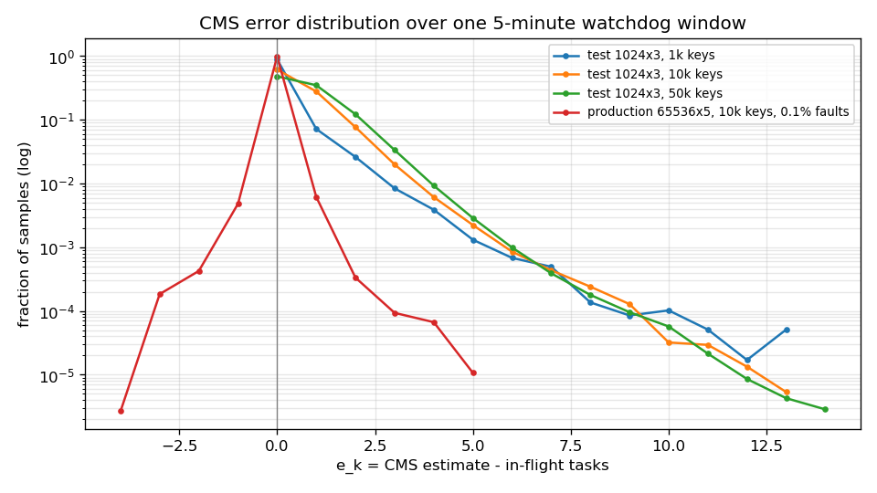
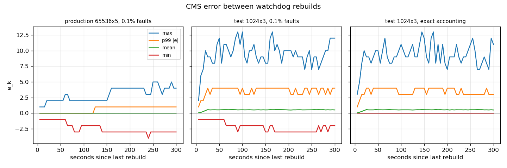

# Equalix — Mathematical Invariants (Revised)

**Version:** 0.2
**Status:** Draft – incorporates review feedback
**Purpose:** Formal foundation for the Equalix scheduler

------

## 1. System Model

Equalix is a capacity allocator for continuously backlogged multi-tenant workloads.

Let:

- KK — set of fairness keys / tenants.
- k∈Kk∈K — one fairness key.
- wk>0wk>0 — configured weight of key kk.
- Qk∈N∪{∞}Qk∈N∪{∞} — concurrency quota (infinite allowed).
- Fk(t)Fk(t) — authoritative number of in-flight tasks at time tt.
- F^k(t)F^k(t) — approximate in-flight estimate used by the scheduler.
- qk(t)qk(t) — number of queued/eligible tasks.
- Wx(t)Wx(t) — waiting time of task xx.
- R(t)R(t) — global dispatch-rate budget.
- Cmax⁡Cmax — global in-flight capacity.
- Fglobal(t)Fglobal(t) — total authoritative in-flight work.
- Tk(t)Tk(t) — accumulated virtual scheduling time (persistent fairness state).
- p(t)p(t) — in-flight pressure coefficient.
- λλ — aging coefficient.
- Px(t)Px(t) — effective priority of task xx.

The fundamental distinction is:

> **Approximate state may influence optimization, but authoritative state defines safety.**

------

## 2. Invariant Hierarchy

Equalix has four conceptual layers:

1. **Safety** — constraints that must never be intentionally violated.
2. **Liveness** — eligible work must eventually receive service.
3. **Fairness** — available capacity should converge toward configured weighted shares.
4. **Optimization** — reduce scheduling latency, contention, executor overload, and fairness error.

The hierarchy is:

Safety  >  Liveness  >  Fairness  >  OptimizationSafety>Liveness>Fairness>Optimization

A lower-level objective must never override a higher-level invariant.

------

## 3. Hard Concurrency Quota

For every fairness key kk:

Fk(t)≤QkFk(t)≤Qk

for all valid times tt.
If Qk=∞Qk​=∞, the inequality is trivially satisfied and eligibility is always true.

A task belonging to kk is normally eligible only when:

Fk(t)<QkFk(t)<Qk

Define quota eligibility:

Ek(t)={1Fk(t)<Qk0Fk(t)≥QkEk(t)={10Fk(t)<QkFk(t)≥Qk

with the convention that if Qk=∞Qk=∞, then Ek(t)=1Ek(t)=1 for all tt.

### Interpretation

Priority answers:

> Which eligible task should run first?

Eligibility answers:

> Is the task allowed to run at all?

Quota is therefore a **hard safety constraint**, not a scheduling preference.

------

## 4. In-Flight Conservation

For each fairness key kk:

Fk(t2)=Fk(t1)+Sk(t1,t2)−Lk(t1,t2)Fk(t2)=Fk(t1)+Sk(t1,t2)−Lk(t1,t2)

where:

- SkSk — tasks entering the in-flight state.
- LkLk — tasks leaving the in-flight state (replaces earlier TkTk to avoid ambiguity with virtual time).

Equivalently:

ΔFk=ΔSk−ΔLkΔFk=ΔSk−ΔLk

A task should enter the in-flight population once and leave it once,  subject to explicitly defined retry/reconciliation semantics.

This invariant is the foundation for quota correctness.

------

## 5. Weighted Long-Term Fairness

Let:

Dk(W)Dk(W)

be the number of dispatches for key kk during scheduling window WW.

For continuously backlogged keys under unconstrained conditions:

Bk(t)=1Bk(t)=1

and where quotas, global capacity, executor health, and explicit suspension do not constrain the key, Equalix seeks:

lim⁡∣W∣→∞Dk(W)∑jDj(W)=wk∑jwj∣W∣→∞lim∑jDj(W)Dk(W)=∑jwjwk

The expected weighted share is:

Ek=wk∑jwjEk=∑jwjwk

### Example

For:

wA=1,wB=2,wC=7wA=1,wB=2,wC=7

the expected shares are:

EA=10%,EB=20%,EC=70%EA=10%,EB=20%,EC=70%

The guarantee applies to **available capacity under comparable demand**, not to absolute task counts.

------

## 6. Fairness Error

Define the observed share:

Sk(W)=Dk(W)∑jDj(W)Sk(W)=∑jDj(W)Dk(W)

Then define per-key fairness error:

ϵk(W)=∣Sk(W)−Ek∣ϵk(W)=∣Sk(W)−Ek∣

System-wide maximum fairness error:

ϵmax⁡(W)=max⁡kϵk(W)ϵmax(W)=kmaxϵk(W)

For an implementation with bounded approximation and discrete scheduling effects, a practical invariant is:

lim sup⁡∣W∣→∞ϵmax⁡(W)≤ϵ∣W∣→∞limsupϵmax(W)≤ϵ

where ϵϵ is an experimentally established error bound.
The value of ϵϵ should be measured rather than assumed.

### Measured bound (EQX-1)

`ProportionalFairnessIntegrationTest` runs the real priority calculator and dispatcher against PostgreSQL with three continuously backlogged tenants, wA : wB : wC = 1 : 2 : 7. The conditions follow §5: no quotas, adaptive RPS off, and no anti-starvation promotion. Each tick dispatches up to 20 tasks, and every dispatched task is completed and replaced. Two scenarios run for 10,000 dispatches each:

- **No pressure:** dispatched tasks complete within the tick, so only virtual time Tk orders the queue.
- **With pressure:** dispatched tasks are still in flight at the next priority calculation, so the CMS pressure term p·F̂k/wk is active.

Prefix ϵmax is measured over the first W dispatches. Sliding ϵmax is the worst over every contiguous window of W dispatches.

| W | No pressure: prefix | No pressure: sliding | With pressure: prefix | With pressure: sliding |
|---|---|---|---|---|
| 10 | 0 | 0 | 0 | 0.10 |
| 25 | 0.02 | 0.02 | 0.02 | 0.06 |
| 100 | 0 | 0 | 0 | 0.01 |
| 1,000 | 0 | 0 | 0 | 0.001 |
| 10,000 | 0 | 0 | 0 | 0 |

At W = 10,000 the observed shares are exactly SA = 10%, SB = 20%, SC = 70%. The results are deterministic across runs.

In task counts, the error is at most 0.5 task without pressure. That is the rounding floor, because W·Ek is not always a whole number. With pressure it is at most 1.5 tasks. The asserted empirical bound is therefore:

ϵmax(W) ≤ 2 / |W|

This means no tenant is ever more than two tasks ahead of or behind its weighted share, in any window. For W = 10,000 this gives ϵ ≤ 0.0002.

As a control, the same experiment with the virtual-time term disabled (`quantum = 0`) gives shares of 33/33/33 without pressure and 0.4/0.4/99.2 with pressure only. So the persistent Tk (§7) is what makes the weighted shares hold.

Scope: the bound covers equal-cost tasks under the conditions of §5. Quota-constrained keys (§25.6), aging (EQX-4) and hierarchical keys (EQX-7) need to be measured again with the same harness.

------

## 7. Virtual Time (Persistent Fairness State)

The scheduler distinguishes **historical allocation state** from **current executor pressure**.

Let:

Tk(t)Tk(t)

be the accumulated virtual scheduling position for fairness key kk.
This is a persistent value that survives across scheduling cycles.

For equal-cost tasks, a classical weighted virtual-time update is:

Tk←Tk+1wkTk←Tk+wk1

after dispatching one task for kk.

For a task with scheduling cost sxsx:

Tk←Tk+sxwkTk←Tk+wksx

Higher weights therefore advance virtual time more slowly.

### Interpretation

Virtual time represents:

> How far this key has progressed through its proportional share of scheduling service.

This gives weighted fairness a persistent state rather than deriving fairness only from instantaneous load.

> **Note on implementation (EQX-3):** Equalix persists Tk in `client_virtual_time` and uses self-clocked fair queueing. When task x of key k is queued it receives a finish tag Fx = max(Fk_last, V) + sx/wk, where Fk_last is the key's previous tag and V is the system virtual time (the highest dispatched tag, stored in `scheduler_virtual_clock`). On dispatch, Tk ← max(Tk, Fx) and V ← max(V, Fx). For a continuously backlogged key this is exactly Tk ← Tk + sx/wk. The V floor stops an idle key from accumulating credit it could spend in a burst. Tags are scaled by `app.queue.virtual-time.quantum`. All tasks currently have sx = 1.

------

## 8. Weighted Priority

Equalix combines accumulated virtual time with current in-flight pressure and task aging.

The base priority is:

Pkbase(t)=Tk(t)+Ik(t)Pkbase(t)=Tk(t)+Ik(t)

where Ik(t)Ik(t) is the in-flight pressure defined below.

Lower priority values are selected first.

------

## 9. In-Flight Pressure

Let:

F^k(t)F^k(t)

be the scheduler's approximate in-flight count.

The initial Equalix pressure model is:

Ik(t)=p(t)F^k(t)wkIk(t)=p(t)wkF^k(t)

where:

- p(t)p(t) — configurable pressure coefficient.
- F^kF^k — approximate in-flight count.
- wkwk — tenant weight.

Thus:

Pkbase(t)=Tk(t)+p(t)F^k(t)wkPkbase(t)=Tk(t)+p(t)wkF^k(t)

### Generalized model

A future implementation may use:

Ik(t)=p(t)F^k(t)αwkβIk(t)=p(t)wkβF^k(t)α

with:

α,β>0α,β>0

The initial model corresponds to:

α=1,β=1α=1,β=1

The generalized form should remain a design parameter rather than an implementation requirement.

------

## 10. Aging / Anti-Starvation

For task xx:

Wx(t)=t−arrivalxWx(t)=t−arrivalx

where WxWx is the time the task has been waiting.

A linear aging function is:

Ax(t)=λWx(t)Ax(t)=λWx(t)

where:

λ>0λ>0

Since lower priority is better, aging reduces effective priority:

Px(t)=Pkbase(t)−λWx(t)Px(t)=Pkbase(t)−λWx(t)

Therefore:

Px(t)=Tk(t)+p(t)F^k(t)wk−λWx(t)Px(t)=Tk(t)+p(t)wkF^k(t)−λWx(t)

As waiting time increases, the task becomes progressively more likely to be selected.

### Implementation and simulation (EQX-4)

`app.queue.aging.policy` selects A(W): `none` (default), `linear` λW, `log` λ·ln(1+W), or `power` λW^γ. W is in seconds and A is in priority units, where one weight-1 task costs `quantum` virtual-time units. Non-linear aging changes the relative order of queued tasks over time, so the dispatcher evaluates Px(t) = Pbase − A(Wx(t)) at selection time. It does this over a candidate pool: the best tasks by stored Pbase plus the oldest tasks. The `max-queued-time-ms` promotion remains a hard backstop.

**Virtual time under aging.** A task promoted by aging is served ahead of its tag Fx. The key is still charged in full (Tk ← max(Tk, Fx)), but the system virtual time only advances to the aged position: V ← max(V, Fx − A(Wx)). Without this, one promoted task drags V forward, and every key's new work restarts from that inflated V. In the burst simulation below, advancing V to the full tag lowers the heavy tenant's minimum share over any 100 dispatches to 37% instead of 65% with `power`, and to 57% instead of 86% with `linear`.

`AgingSimulationTest` runs the production VirtualTimeService and AgingService with tenants at weights 1 and 9 and a capacity of 10 tasks/s. Every policy is calibrated so that A(30 s) equals 10 weight-1 tasks:

- linear: λ = 333
- log: λ = 2912
- power: λ = 11.1, γ = 2

**Steady backlog.** Both tenants keep 50 tasks queued. The weight-1 share stays at 10% under every policy (sliding ϵmax(W=100) ≤ 0.01). With constant queue depth, each tenant's waiting time is constant, so aging adds only a constant offset per tenant, and virtual time keeps service rates proportional to weight. Aging cannot fracture long-term weighted shares.

**Structural backlog.** The weight-9 tenant is backlogged, and the weight-1 tenant submits a burst of 300 tasks:

| Policy | Burst wait p50 | Burst wait max | Weight-9 share while burst drains | Lowest weight-9 share over any 100 dispatches |
|---|---|---|---|---|
| none | 149 s | 299 s | 90% | 89% |
| linear | 115 s | 230 s | 87% | 86% |
| log | 137 s | 285 s | 89% | 83% |
| power (γ=2) | 82 s | 131 s | 77% | 65% |

Findings:

- `power` promotes long waits most aggressively: the maximum wait drops by 56% at equal 30 s credit.
- `log` gives a front-loaded boost that flattens, so it barely helps long waits.
- Under every policy, the heavy tenant keeps the majority of capacity in every 100-dispatch window. Short-term weighted quotas are bent but not broken.

The simulation asserts these properties.

------

## 11. Deriving a Starvation Bound

Suppose task xx has initial priority P0P0, and a competing task has priority PcPc.

Task xx becomes preferable when:

P0−λt≤PcP0−λt≤Pc

Therefore:

λt≥P0−Pcλt≥P0−Pc

and:

t≥P0−Pcλt≥λP0−Pc

This provides a direct relationship between:

- initial scheduling disadvantage,
- aging rate,
- maximum waiting time.

The actual starvation bound additionally depends on continuous availability of dispatch capacity and the behavior of other tasks.

------

## 12. Quota Eligibility and Priority Are Separate

The scheduler should conceptually perform:

### Step 1 — eligibility

Ek(t)=[Fk(t)<Qk]Ek(t)=[Fk(t)<Qk]

(if Qk=∞Qk=∞, always true)

### Step 2 — priority

Px(t)=Tk(t)+p(t)F^k(t)wk−λWx(t)Px(t)=Tk(t)+p(t)wkF^k(t)−λWx(t)

### Step 3 — selection

Choose the minimum-priority task among eligible tasks.

This separation prevents fairness logic from accidentally overriding hard safety constraints.

------

## 13. Global RPS Capacity

Let:

R(t)R(t)

be the current global dispatch rate in tasks/second.

For scheduling interval ΔtΔt, the rate-derived budget is:

BR(t,Δt)=⌈R(t)Δt⌉BR(t,Δt)=⌈R(t)Δt⌉

If Equalix also has a global concurrency limit Cmax⁡Cmax:

Fglobal(t)=∑kFk(t)Fglobal(t)=k∑Fk(t)

and free concurrency is:

BC(t)=Cmax⁡−Fglobal(t)BC(t)=Cmax−Fglobal(t)

The dispatch budget becomes:

B(t)=max⁡(0,min⁡(BR,BC))B(t)=max(0,min(BR,BC))

Thus:

D(t,t+Δt)≤B(t)D(t,t+Δt)≤B(t)

------

## 14. Capacity Control vs. Fairness Control

Equalix contains two distinct control planes.

### Capacity control

R(t)R(t)

determines:

> How much work can be admitted to the executor.

### Fairness control

Px(t)Px(t)

determines:

> Which eligible task receives the next unit of capacity.

Therefore:

Adaptive RPS allocates capacityAdaptive RPS allocates capacity

while:

Virtual scheduling allocates available capacity among tenantsVirtual scheduling allocates available capacity among tenants

This distinction should remain explicit in the architecture.

------

## 15. Tie-Breaking

If two tasks have equal effective priority:

Px=PyPx=Py

Equalix should use deterministic secondary ordering.

Define:

x≺yx≺y

iff, lexicographically:

(Px,arrivalx,idx)<(Py,arrivaly,idy)(Px,arrivalx,idx)<(Py,arrivaly,idy)

Therefore the ordering is:

1. lowest effective priority,
2. oldest arrival,
3. deterministic task ID.

Formally:

x∗=arg⁡min⁡x(Px,arrivalx,idx)x∗=argxmin(Px,arrivalx,idx)

This avoids relying on unspecified database ordering.

------

## 16. Approximate In-Flight State

Let:

Fk(t)Fk(t)

be the authoritative count and:

F^k(t)F^k(t)

the approximate scheduler estimate.

Define CMS error:

ek(t)=F^k(t)−Fk(t)ek(t)=F^k(t)−Fk(t)

Therefore:

F^k(t)=Fk(t)+ek(t)F^k(t)=Fk(t)+ek(t)

The scheduler does not assume ek=0ek=0.

------

## 17. Propagation of CMS Error

The pressure term is:

Ik=pF^kwkIk=pwkF^k

Substituting:

F^k=Fk+ekF^k=Fk+ek

gives:

I^k=pFk+ekwkI^k=pwkFk+ek

Therefore:

I^k−Ik=pekwkI^k−Ik=pwkek

The resulting priority error is:

P^k−Pk=pekwkP^k−Pk=pwkek

assuming virtual time and aging are unchanged.

If:

∣ek∣≤E∣ek∣≤E

then:

∣P^k−Pk∣≤pEwk∣P^k−Pk∣≤pwkE

This gives a direct way to measure how approximate accounting affects scheduling.

**Validated (EQX-2):** `CmsErrorPropagationTest` prioritises the same 2,000 tasks twice with the production `PriorityCalculatorService`: once with a heavily loaded 1024×3 sketch (E = 14, 75% of keys overestimated) and once with exact counts. For p ∈ {10, 100, 1000} and weights {0.5, 1, 2, 7}, every task satisfies ∣P̂k − Pk∣ ≤ p·∣ek∣/wk + 1, and therefore also ≤ p·E/wk + 1. The +1 comes from the integer truncation of the pressure term.

------

## 18. Overestimation vs. Underestimation

### Overestimation

If:

ek>0ek>0

then:

F^k>FkF^k>Fk

and:

P^k>PkP^k>Pk

The key receives excessive scheduling pressure.

Effect:

> Temporary under-allocation of capacity.

This is generally a fairness/performance error rather than a safety violation.

### Underestimation

If:

ek<0ek<0

then:

F^k<FkF^k<Fk

and:

P^k<PkP^k<Pk

The key may receive more scheduling opportunities than its actual load would suggest.

Effect:

> Temporary over-allocation of capacity.

This is why the approximate count must not be the sole source of hard quota enforcement.

------

## 19. Critical CMS Safety Boundary

The fundamental rule is:

CMS→optimizationCMS→optimization

and:

authoritative state→safetyauthoritative state→safety

In particular:

F^k<QkF^k<Qk

must **not** be interpreted as proof that:

Fk<QkFk<Qk

Instead, quota enforcement must ultimately rely on authoritative state.

CMS error may therefore affect:

- scheduling order,
- fairness precision,
- temporary load distribution,

but must not intentionally invalidate:

- hard concurrency limits,
- durable state transitions,
- accounting invariants.

------

## 20. CMS Mathematical Caveat and Practical Approach

Classical Count-Min Sketch guarantees are normally stated for non-negative frequency updates.

If Equalix performs both:

+1+1

and:

−1−1

updates in the same sketch, classical Count-Min Sketch guarantees should **not automatically be claimed**.

Therefore Equalix should currently define:

ek(t)=F^k(t)−Fk(t)ek(t)=F^k(t)−Fk(t)

and measure its empirical distribution:

- mean error,
- maximum error,
- p95 error,
- p99 error,
- underestimation frequency,
- overestimation frequency.

A formal signed-update error bound should only be introduced after  selecting and proving the properties of an appropriate data structure.

In the interim, the system employs a **Watchdog** that periodically reconstructs the approximate counts from the  authoritative task table, bounding drift. This pragmatic approach  maintains safety while empirical data on error distributions is  collected.

### Measured distribution (EQX-2)

**Why signed updates are safe here.** Equalix updates the sketch in the *strict turnstile* model. Every −1 (completion) matches an earlier +1 (dispatch) of the same key, so every true count stays Fk ≥ 0. Under that condition, the classical Count-Min guarantees still hold:

- **No underestimation:** every cell is at least the key's own count, so ek ≥ 0.
- **Bounded overestimation:** ek ≤ 2N/w with probability ≥ 1 − 2⁻ᵈ.

Here N is the **current** total in flight, not the number of updates made since the last rebuild. Error therefore does not accumulate with traffic. Underestimation can only come from accounting faults, where an update is applied without its matching DB change.

**Experiment.** `CmsSignedUpdateErrorExperimentTest` sends a seeded stream of +1/−1 updates to `CountMinSketchAdapter`:

- about 5,000 tasks in flight, over Zipf-distributed keys (exponent 1.1);
- one watchdog window: 300,000 updates, i.e. 5 minutes at 1,000 updates/s;
- 60 samples per window, of every key that was ever dispatched.

| Sketch               | Keys           | Samples       | Mean e | p95 ∣e∣ | p99 ∣e∣ | Max | Over  | Under | 2N/w | Samples > 2N/w |
|----------------------|----------------|---------------|--------|---------|---------|-----|-------|-------|------|----------------|
| 1024×3 (test)        | 1,000          | 58,651        | 0.18   | 1       | 3       | 13  | 11.3% | 0     | 9.6  | 0.022%         |
| 1024×3 (test)        | 10,000         | 373,857       | 0.54   | 2       | 4       | 13  | 38.5% | 0     | 9.7  | 0.009%         |
| 1024×3 (test)        | 50,000         | 699,283       | 0.76   | 2       | 4       | 14  | 51.9% | 0     | 9.7  | 0.010%         |
| 65536×5 (production) | 1k / 10k / 50k | up to 699,283 | 0      | 0       | 0       | 0   | 0     | 0     | 0.15 | 0              |

With exact accounting:

- **No underestimation** in about 2.4 million samples.
- The 2N/w bound is exceeded far less often than the allowed 2⁻ᵈ.
- The **production-size sketch was exact in every sample, even with 50,000 keys.** Error depends on the number of keys *currently in flight* (at most N), not on how many keys exist.

**Accounting faults.** `cms.add` currently runs inside the dispatch and completion transactions. A rollback therefore leaves a phantom +1 (a dispatch that never happened) or an extra −1 (a completion rolled back and then retried). Injecting each fault at 0.1% gives:

| Sketch  | Mean e | Min | Max | p99 ∣e∣ | Over  | Under |
|---------|--------|-----|-----|---------|-------|-------|
| 65536×5 | 0.001  | −4  | +5  | 1       | 0.67% | 0.54% |
| 1024×3  | 0.54   | −3  | +13 | 4       | 38.7% | 0.54% |

Faults are never reversed within a window, so drift grows in both directions until the watchdog rebuild resets it. After the rebuild, the error is back to exact-accounting behaviour.

The charts are generated by `docs/samples/plot_cms_error.py` from the CSV output in `target/eqx-2/`.

**Hash-code collisions (known limitation).** Every sketch row is derived from the 32-bit `String.hashCode()`. Keys with equal hash codes therefore share all d cells, and no sketch size can separate them. For example, `tenant-Aa` and `tenant-BB` collide: with 40 tasks in flight for `tenant-BB`, the production-size sketch estimates 40 for an idle `tenant-Aa`. Random keys collide with probability of about K²/2³³, but structured identifiers collide deterministically. Both the local and Redis adapters are affected.

**Consequences:**

- **Drift alerts (EQX-5, implemented).** The watchdog publishes ek per key (`equalix.cms.estimation.drift`) and in aggregate just before each rebuild; see Operations. With a production-size sketch and exact accounting, ek = 0 is the expected value. Any sustained ∣ek∣ ≥ 1 points to an accounting fault or a hash-code collision, not sketch noise. For small sketches, use the measured p99 (4 for 1024×3 at 5,000 in flight) as the noise floor.
- **Priority error.** Through §17, a p99 error of 4 bounds the priority error at 4p/wk.
- **Follow-ups:**
  - apply CMS updates only after the transaction commits, which removes fault drift;
  - derive the row hashes from a 64-bit hash of the key bytes. This changes cell placement, so a persisted Redis sketch has to be rebuilt.

------

## 21. Complete Equalix Priority Function

Combining the mechanisms:

Px(t)=Tk(t)+p(t)F^k(t)wk−λWx(t)Px(t)=Tk(t)+p(t)wkF^k(t)−λWx(t)

where task xx belongs to key kk.

The components have distinct responsibilities:

Tk⏟weighted fairness+pF^kwk⏟in-flight pressure−λWx⏟anti-starvationweighted fairnessTk+in-flight pressurepwkF^k−anti-starvationλWx

This separation is central to the Equalix model.

------

## 22. Complete Scheduling Algorithm

For each scheduling cycle:

### 1. Determine available capacity

B(t)=max⁡(0,min⁡[⌈R(t)Δt⌉,Cmax⁡−Fglobal(t)])B(t)=max(0,min[⌈R(t)Δt⌉,Cmax−Fglobal(t)])

### 2. Determine eligible tasks

Ek(t)=[Fk(t)<Qk]Ek(t)=[Fk(t)<Qk]

(with Qk=∞Qk=∞ always eligible)

### 3. Calculate effective priority

Px(t)=Tk(t)+p(t)F^k(t)wk−λWx(t)Px(t)=Tk(t)+p(t)wkF^k(t)−λWx(t)

### 4. Select

x∗=arg⁡min⁡x(Px,arrivalx,idx)x∗=argxmin(Px,arrivalx,idx)

among eligible tasks.

### 5. Dispatch

Dispatch up to B(t)B(t) tasks.

### 6. Update virtual time

For equal-cost tasks:

Tk←Tk+1wkTk←Tk+wk1

### 7. Update authoritative accounting

Fk←Fk+1Fk←Fk+1

when a task becomes genuinely in-flight.

Completion decrements the authoritative count according to the task lifecycle semantics.

------

## 23. Core Equalix Invariants

The mathematical model can therefore be summarized by the following invariants.

## Safety

Fk(t)≤QkFk(t)≤Qk

for every key kk.

## Global capacity

Fglobal(t)≤Cmax⁡Fglobal(t)≤Cmax

and:

D(t,t+Δt)≤⌈R(t)Δt⌉D(t,t+Δt)≤⌈R(t)Δt⌉

## Liveness

For an eligible task with continuously available dispatch capacity:

Wx(t)≤Wmax⁡Wx(t)≤Wmax

subject to the configured aging policy and system assumptions.

## Weighted fairness

For continuously backlogged and unconstrained keys:

lim sup⁡∣W∣→∞∣Sk(W)−Ek∣≤ϵ∣W∣→∞limsup∣Sk(W)−Ek∣≤ϵ

where:

Ek=wk∑jwjEk=∑jwjwk

## Approximation

F^k=Fk+ekF^k=Fk+ek

with CMS error affecting optimization but not authoritative safety.

------

## 24. Design Principle

The Equalix scheduler can be summarized as:

Priority=Fairness+Pressure−AgingPriority=Fairness+Pressure−Aging

more explicitly:

Px=Tk⏟historical weighted allocation+pF^kwk⏟current load−λWx⏟waiting-time compensationPx=historical weighted allocationTk+current loadpwkF^k−waiting-time compensationλWx

while:

Eligibility=authoritative quota stateEligibility=authoritative quota state

and:

Capacity=adaptive global RPS/concurrency budgetCapacity=adaptive global RPS/concurrency budget

This separation gives each mechanism one clear responsibility.

------

## 25. Open Design Questions

The following remain explicitly unresolved in v0.2. Some are addressed with interim strategies.

### 25.1 Virtual time model

Should Equalix use:

TkTk

as persistent accumulated virtual time, or adopt the simpler current-time formulation?

**Resolved (EQX-3):** Equalix uses persistent accumulated virtual time Tk with a system virtual-time floor V (see §7). Long-term convergence to the weighted shares is validated in EQX-1.

### 25.2 Pressure coefficient

How should:

p(t)p(t)

relate to executor latency, error rate, and global RPS?

**Interim:** p(t)=1000/R(t)p(t)=1000/R(t) is used; stability analysis and adaptive tuning are ongoing.

### 25.3 Aging function

Should aging be:

A(W)=λWA(W)=λW

or bounded/non-linear?

Potential alternatives:

A(W)=λlog⁡(1+W)A(W)=λlog(1+W)

or:

A(W)=λWγA(W)=λWγ

**Implemented (EQX-4):** `none`, `linear`, `log` and `power` are configurable; the default is `none`. The trade-offs measured by simulation are in §10. Use `power` with γ > 1 when long waits must be bounded, and `log` when disruption must stay minimal.

### 25.4 CMS semantics

What data structure provides useful and defensible error bounds when counters can both increment and decrement?

**Answered for Equalix's usage (EQX-2):** Updates follow the strict turnstile model, so the standard Count-Min sketch keeps its guarantees: ek ≥ 0, and ek ≤ 2N/w with probability ≥ 1 − 2⁻ᵈ, where N is the current in-flight total. The measurements in §20 confirm this. Drift in both directions comes only from accounting faults and hash-code collisions, and the Watchdog bounds its lifetime. A general-turnstile structure is not needed unless updates stop being paired.

### 25.5 Fairness window

What constitutes a "sufficiently large" window WW?

**Measured (EQX-1):** Under continuous backlog, weighted shares hold to within 2 tasks over any window (ϵmax(W) ≤ 2/|W|, see §6). Windows of a few hundred dispatches are therefore already within 1%. Production benchmarks with irregular arrivals are still pending.

### 25.6 Fairness under quota constraints

How should expected weighted shares be calculated when some tenants are continuously quota-constrained?

**Note:** The guarantee only applies when keys are not quota‑limited. Future work may extend the model to incorporate quota pressure.

### 25.7 Adaptive controller stability

What conditions prevent oscillation in:

R(t)R(t)

when executor latency and error rates fluctuate?

**Interim:** Hysteresis and smoothing are applied; formal stability analysis is a future task.

------

## 26. Intended Evolution

This document should be treated as a mathematical contract under development.

The intended progression is:

Model→Simulation→Implementation→Benchmark→RefinementModel→Simulation→Implementation→Benchmark→Refinement

Before claiming a formal guarantee, Equalix should validate the corresponding invariant through simulation and load testing.

The most important next experiment is to demonstrate weighted fairness (done in EQX-1, see §6 for the measured bound):

wA:wB:wC=1:2:7wA:wB:wC=1:2:7

and measure:

SA, SB, SCSA, SB, SC

over increasing scheduling windows.

The second experiment should measure how:

ek=F^k−Fkek=F^k−Fk

propagates into fairness error.

A third experiment should evaluate the stability of the adaptive RPS controller under varying load.

------

## Final Mathematical Model

The current proposed Equalix model is:

Ek(t)=[Fk(t)<Qk](with Qk=∞⇒Ek=1)Ik(t)=p(t)F^k(t)wkAx(t)=λWx(t)Px(t)=Tk(t)+Ik(t)−Ax(t)x∗=arg⁡min⁡x(Px,arrivalx,idx)Tk←Tk+1wkEk(t)Ik(t)Ax(t)Px(t)x∗Tk=[Fk(t)<Qk](with Qk=∞⇒Ek=1)=p(t)wkF^k(t)=λWx(t)=Tk(t)+Ik(t)−Ax(t)=argxmin(Px,arrivalx,idx)←Tk+wk1

subject to:

Fk(t)≤QkFk(t)≤QkFglobal(t)≤Cmax⁡Fglobal(t)≤CmaxD(t,t+Δt)≤⌈R(t)Δt⌉D(t,t+Δt)≤⌈R(t)Δt⌉

and, under continuously backlogged unconstrained demand:

lim sup⁡∣W∣→∞∣Dk(W)∑jDj(W)−wk∑jwj∣≤ϵ∣W∣→∞limsup∑jDj(W)Dk(W)−∑jwjwk≤ϵ

This is the proposed mathematical foundation for Equalix v0.2.

------

**Revision history:**

- v0.1 – initial draft.
- v0.6 – watchdog publishes CMS drift ek per key and in aggregate before each rebuild (EQX-5).
- v0.5 – measured signed-update CMS error distribution and strict-turnstile bound; validated §17 priority-error bound; identified accounting-fault drift and hash-code collisions (EQX-2).
- v0.4 – configurable aging A(W) (none/linear/log/power) evaluated at dispatch, aged system virtual time, simulation results (EQX-4).
- v0.3 – persistent virtual time Tk implemented (EQX-3); weighted-fairness bound ϵmax(W) ≤ 2/|W| measured (EQX-1).
- v0.2 – clarified notation (leaves LkLk), added infinite quota semantics, expanded CMS caveat with practical  mitigation, added stability as an open question, and aligned the model  with the intended persistent virtual time design.